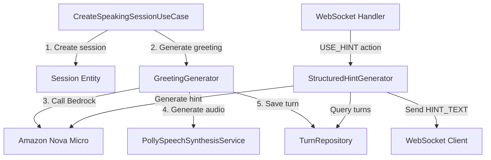

# Design Document: Conversation Flow UX Improvements

## Overview

This design addresses two critical UX gaps in the Lexi conversation system:

1. **Empty Start Problem**: Sessions currently start with no AI greeting, leaving learners uncertain about how to begin
2. **Oversimplified Hints**: Current hints provide only a single sentence ("You could say...") instead of structured guidance

The solution introduces:
- **AI Greeting Generation**: Level-appropriate greetings and first questions generated at session creation
- **Structured Hints**: Enhanced hints with conversation context, goals, examples, and grammar tips in bilingual format

**Design Principles:**
- Backward compatibility: existing sessions and clients continue to work
- Cost efficiency: use Amazon Nova Micro for all LLM calls
- Performance: greeting/hint generation completes within 2 seconds (p95)
- Simplicity: minimal code changes, reuse existing services

## Architecture

### High-Level Component Interaction



### Data Flow: Greeting Generation

```
CreateSpeakingSessionUseCase.execute()
  ├─> Create Session entity
  ├─> Generate greeting text (level-appropriate template)
  ├─> Generate first question (Bedrock call)
  ├─> Combine greeting + question
  ├─> Generate TTS audio (Polly)
  ├─> Save Turn(turn_index=0, speaker=AI, content=greeting+question, audio_url=...)
  └─> Return CreateSpeakingSessionResponse
```

### Data Flow: Structured Hint Generation

```
WebSocket Handler.use_hint()
  ├─> Get session and turns
  ├─> Extract context (last AI turn, goals, level)
  ├─> Call StructuredHintGenerator.generate()
  │   ├─> Build prompt with context
  │   ├─> Call Bedrock (Amazon Nova Micro)
  │   └─> Parse JSON response
  ├─> Validate structured hint
  └─> Send HINT_TEXT event with structured hint object
```

## Components and Interfaces

### 1. GreetingGenerator (New Domain Service)

**Location**: `src/domain/services/greeting_generator.py`

**Responsibility**: Generate level-appropriate greetings and first questions

**Interface**:
```python
@dataclass
class GreetingResult:
    greeting_text: str
    first_question: str
    combined_text: str

class GreetingGenerator:
    def __init__(self, bedrock_client):
        self._bedrock = bedrock_client
        self._greeting_templates = self._load_templates()
    
    def generate(
        self,
        level: ProficiencyLevel,
        scenario_title: str,
        learner_role: str,
        ai_role: str,
        selected_goals: list[str],
        ai_gender: Gender
    ) -> GreetingResult:
        """Generate greeting and first question for session start."""
        pass
```

**Greeting Templates** (cached, no LLM call):
```python
GREETING_TEMPLATES = {
    "A1": "Hi! How are you?",
    "A2": "Hello! How are you doing?",
    "B1": "Hi there! How's it going?",
    "B2": "Hello! How have you been?",
    "C1": "Hi! How are things with you?",
    "C2": "Greetings! How have you been lately?"
}
```

**First Question Generation** (Bedrock call):
- Prompt includes: scenario, roles, goals, level
- Model: Amazon Nova Micro (apac.amazon.nova-micro-v1:0)
- Max tokens: 100
- Temperature: 0.7

### 2. StructuredHintGenerator (New Domain Service)

**Location**: `src/domain/services/structured_hint_generator.py`

**Responsibility**: Generate structured bilingual hints

**Interface**:
```python
@dataclass
class StructuredHint:
    conversation_context: dict[str, str]  # {"vi": "...", "en": "..."}
    turn_goal: dict[str, str]
    suggested_approach: dict[str, str]
    example_phrases: dict[str, list[str]]
    grammar_tip: dict[str, str]

class StructuredHintGenerator:
    def __init__(self, bedrock_client):
        self._bedrock = bedrock_client
    
    def generate(
        self,
        session: Session,
        last_ai_turn: Turn | None,
        turn_history: list[Turn]
    ) -> StructuredHint:
        """Generate structured bilingual hint."""
        pass
```

**Bedrock Prompt Structure**:
```
System: You are an English tutor providing structured hints to Vietnamese learners.

User: Generate a structured hint for this conversation:
- Last AI message: "{last_ai_turn.content}"
- Learner level: {session.level}
- Current goal: {session.selected_goals[0]}
- Learner role: {session.learner_role_id}

Provide a JSON response with these fields (all bilingual Vietnamese/English):
{
  "conversation_context": {"vi": "...", "en": "..."},
  "turn_goal": {"vi": "...", "en": "..."},
  "suggested_approach": {"vi": "...", "en": "..."},
  "example_phrases": {"vi": ["...", "..."], "en": ["...", "..."]},
  "grammar_tip": {"vi": "...", "en": "..."}
}
```

### 3. CreateSpeakingSessionUseCase (Modified)

**Changes**:
- After creating session, call `GreetingGenerator.generate()`
- Create Turn entity with turn_index=0, speaker=AI
- Generate TTS audio for greeting
- Save turn to repository
- Handle failures gracefully (session creation succeeds even if greeting fails)

**Pseudocode**:
```python
def execute(self, request: CreateSpeakingSessionCommand) -> Result:
    # Existing session creation logic...
    session = Session(...)
    self._session_repo.save(session)
    
    # NEW: Generate greeting and first question
    try:
        greeting_result = self._greeting_generator.generate(
            level=session.level,
            scenario_title=session.scenario_title,
            learner_role=session.learner_role_id,
            ai_role=session.ai_role_id,
            selected_goals=session.selected_goals,
            ai_gender=session.ai_gender
        )
        
        # Generate audio
        audio_url = self._speech_synthesis_service.synthesize(
            greeting_result.combined_text,
            gender=session.ai_gender,
            object_key=f"speaking/audio/{session.session_id}/0.mp3"
        )
        
        # Save greeting turn
        greeting_turn = Turn(
            session_id=session.session_id,
            turn_index=0,
            speaker=Speaker.AI,
            content=greeting_result.combined_text,
            audio_url=audio_url,
            is_hint_used=False
        )
        self._turn_repo.save(greeting_turn)
        
    except Exception as e:
        logger.warning(f"Failed to generate greeting: {e}")
        # Continue without greeting (backward compatibility)
    
    return Result.success(CreateSpeakingSessionResponse(...))
```

### 4. WebSocketSessionController.use_hint (Modified)

**Changes**:
- Replace `_generate_contextual_hint()` with `StructuredHintGenerator.generate()`
- Send structured hint object in HINT_TEXT event
- Maintain backward compatibility with simple string format

**Pseudocode**:
```python
def use_hint(self, session_id: str, connection_id: str) -> dict[str, Any]:
    session = self._get_session(session_id)
    if not session:
        return _response(404, {"message": "Session không tồn tại."})
    
    self._sync_connection(session, connection_id)
    turns = self.turn_repo.list_by_session(session_id)
    
    # NEW: Generate structured hint
    try:
        last_ai_turn = next(
            (t for t in reversed(turns) if t.speaker == Speaker.AI),
            None
        )
        
        structured_hint = self._structured_hint_generator.generate(
            session=session,
            last_ai_turn=last_ai_turn,
            turn_history=turns
        )
        
        # Send structured hint
        self.send_message({
            "event": "HINT_TEXT",
            "hint": {
                "conversation_context": structured_hint.conversation_context,
                "turn_goal": structured_hint.turn_goal,
                "suggested_approach": structured_hint.suggested_approach,
                "example_phrases": structured_hint.example_phrases,
                "grammar_tip": structured_hint.grammar_tip
            }
        })
        
    except Exception as e:
        logger.warning(f"Failed to generate structured hint: {e}")
        # Fallback to simple hint (backward compatibility)
        simple_hint = self._build_hint(session)
        self.send_message({"event": "HINT_TEXT", "hint": simple_hint})
    
    return _response(200, {"message": "Hint sent"})
```

## Data Models

### StructuredHint Data Structure

```python
@dataclass
class StructuredHint:
    """Structured bilingual hint for learners."""
    
    conversation_context: dict[str, str]  # {"vi": "Bạn đang nói về...", "en": "You are talking about..."}
    turn_goal: dict[str, str]             # {"vi": "Mục tiêu: ...", "en": "Goal: ..."}
    suggested_approach: dict[str, str]    # {"vi": "Bạn có thể...", "en": "You could..."}
    example_phrases: dict[str, list[str]] # {"vi": ["...", "..."], "en": ["...", "..."]}
    grammar_tip: dict[str, str]           # {"vi": "Lưu ý: ...", "en": "Note: ..."}
    
    def to_dict(self) -> dict:
        """Convert to JSON-serializable dict."""
        return {
            "conversation_context": self.conversation_context,
            "turn_goal": self.turn_goal,
            "suggested_approach": self.suggested_approach,
            "example_phrases": self.example_phrases,
            "grammar_tip": self.grammar_tip
        }
```

### WebSocket Response Format

**HINT_TEXT Event (New Format)**:
```json
{
  "event": "HINT_TEXT",
  "hint": {
    "conversation_context": {
      "vi": "Bạn đang nói về sở thích của mình",
      "en": "You are talking about your hobbies"
    },
    "turn_goal": {
      "vi": "Mục tiêu: Chia sẻ thêm chi tiết về sở thích",
      "en": "Goal: Share more details about your hobby"
    },
    "suggested_approach": {
      "vi": "Bạn có thể nói về tần suất hoặc lý do bạn thích nó",
      "en": "You could talk about how often you do it or why you like it"
    },
    "example_phrases": {
      "vi": [
        "Tôi thích nó vì...",
        "Tôi thường làm điều đó vào..."
      ],
      "en": [
        "I like it because...",
        "I usually do it on..."
      ]
    },
    "grammar_tip": {
      "vi": "Dùng 'I like + V-ing' để nói về sở thích",
      "en": "Use 'I like + V-ing' to talk about hobbies"
    }
  }
}
```

**HINT_TEXT Event (Backward Compatible - Simple String)**:
```json
{
  "event": "HINT_TEXT",
  "hint": "You could say something about: your hobbies"
}
```

## Correctness Properties

*Property-based testing is not applicable to this feature because:*

1. **LLM Output Variability**: Greeting and hint generation use LLMs with temperature > 0, producing non-deterministic outputs that cannot be verified with universal properties
2. **External Service Dependencies**: The feature relies on AWS Bedrock and Polly, which are external services with their own behavior
3. **UI/UX Focus**: The feature primarily improves user experience through better content generation, not algorithmic correctness
4. **Subjective Quality**: "Level-appropriate" and "contextual relevance" are subjective qualities that require human evaluation

**Alternative Testing Strategy**: Use example-based unit tests with mocked LLM responses, integration tests with real services, and manual QA for content quality.

## Error Handling

### Greeting Generation Failures

**Failure Modes**:
1. Bedrock API timeout or error
2. TTS synthesis failure
3. Turn repository save failure

**Handling Strategy**:
- Log error with context (session_id, level, scenario)
- Continue session creation without greeting (backward compatible)
- Return success response (session creation succeeded)
- Frontend handles missing greeting turn gracefully

**Code Pattern**:
```python
try:
    greeting_result = self._greeting_generator.generate(...)
    audio_url = self._speech_synthesis_service.synthesize(...)
    self._turn_repo.save(greeting_turn)
except Exception as e:
    logger.warning(
        f"Failed to generate greeting for session {session.session_id}: {e}",
        extra={"session_id": session.session_id, "level": session.level}
    )
    # Continue without greeting - backward compatible
```

### Structured Hint Generation Failures

**Failure Modes**:
1. Bedrock API timeout or error
2. JSON parsing failure (malformed LLM response)
3. Missing required fields in response

**Handling Strategy**:
- Log error with context
- Fallback to simple hint format (existing `_build_hint()` method)
- Send HINT_TEXT event with simple string
- Frontend handles both formats

**Code Pattern**:
```python
try:
    structured_hint = self._structured_hint_generator.generate(...)
    self.send_message({"event": "HINT_TEXT", "hint": structured_hint.to_dict()})
except Exception as e:
    logger.warning(f"Failed to generate structured hint: {e}")
    simple_hint = self._build_hint(session)
    self.send_message({"event": "HINT_TEXT", "hint": simple_hint})
```

### Validation

**StructuredHint Validation**:
```python
def validate_structured_hint(hint: dict) -> bool:
    """Validate structured hint has required fields."""
    required_fields = [
        "conversation_context",
        "turn_goal",
        "suggested_approach",
        "example_phrases",
        "grammar_tip"
    ]
    
    for field in required_fields:
        if field not in hint:
            return False
        
        # Check bilingual structure
        if not isinstance(hint[field], dict):
            return False
        
        if "vi" not in hint[field] or "en" not in hint[field]:
            return False
    
    # Check example_phrases is list
    if not isinstance(hint["example_phrases"]["vi"], list):
        return False
    if not isinstance(hint["example_phrases"]["en"], list):
        return False
    
    return True
```

## Testing Strategy

### Unit Tests

**GreetingGenerator Tests**:
- Test greeting template selection per level (A1-C2)
- Test first question generation with mocked Bedrock
- Test combined text format
- Test error handling (Bedrock failure)

**StructuredHintGenerator Tests**:
- Test hint generation with mocked Bedrock
- Test JSON parsing from LLM response
- Test validation of required fields
- Test error handling (malformed JSON, missing fields)

**CreateSpeakingSessionUseCase Tests**:
- Test session creation with greeting generation
- Test session creation when greeting generation fails (backward compatibility)
- Test greeting turn saved with correct turn_index=0
- Test audio generation for greeting

**WebSocketSessionController Tests**:
- Test use_hint with structured hint generation
- Test use_hint fallback to simple hint on error
- Test HINT_TEXT event format (structured vs simple)

### Integration Tests

**End-to-End Greeting Flow**:
1. Create session via API
2. Verify greeting turn exists (turn_index=0)
3. Verify audio URL is valid
4. Verify greeting content is level-appropriate

**End-to-End Hint Flow**:
1. Connect to WebSocket
2. Send USE_HINT action
3. Verify HINT_TEXT event received
4. Verify structured hint has all required fields
5. Verify bilingual content (vi + en)

### Manual QA

**Content Quality Checks**:
- Greeting appropriateness per level (A1-C2)
- First question relevance to scenario and goals
- Hint contextual relevance to conversation
- Translation quality (Vietnamese ↔ English)
- Grammar tip accuracy

**Performance Checks**:
- Greeting generation latency < 2s (p95)
- Hint generation latency < 2s (p95)
- Cost per greeting/hint (track Bedrock usage)

## Implementation Plan

### Phase 1: Greeting Generation

**Files to Create**:
- `src/domain/services/greeting_generator.py`

**Files to Modify**:
- `src/application/use_cases/speaking_session_use_cases.py` (CreateSpeakingSessionUseCase)

**Steps**:
1. Create GreetingGenerator with template-based greetings
2. Add Bedrock integration for first question generation
3. Modify CreateSpeakingSessionUseCase to call GreetingGenerator
4. Add error handling and logging
5. Write unit tests
6. Write integration tests

### Phase 2: Structured Hints

**Files to Create**:
- `src/domain/services/structured_hint_generator.py`

**Files to Modify**:
- `src/infrastructure/handlers/websocket_handler.py` (use_hint method)

**Steps**:
1. Create StructuredHintGenerator with Bedrock integration
2. Define StructuredHint data structure
3. Modify WebSocketSessionController.use_hint to use StructuredHintGenerator
4. Add fallback to simple hint format
5. Add validation for structured hint
6. Write unit tests
7. Write integration tests

### Phase 3: Deployment and Monitoring

**Monitoring Metrics**:
- Greeting generation success rate
- Greeting generation latency (p50, p95, p99)
- Hint generation success rate
- Hint generation latency (p50, p95, p99)
- Bedrock API errors
- Cost per session (greeting + hints)

**Rollout Strategy**:
1. Deploy to staging environment
2. Manual QA for content quality
3. Performance testing (latency, cost)
4. Deploy to production with feature flag
5. Monitor metrics for 24 hours
6. Gradual rollout to 100% of users

## Backward Compatibility Strategy

### Existing Sessions

**Problem**: Sessions created before this feature have no greeting turn

**Solution**: 
- Frontend checks if turn_index=0 exists
- If missing, frontend shows "Start speaking" prompt instead
- No backend changes needed

### Old Clients

**Problem**: Old clients expect simple string hints

**Solution**:
- WebSocket handler sends structured hint object
- Old clients ignore unknown fields (JSON parsing is lenient)
- If old client breaks, fallback to simple hint format via feature flag

### API Contracts

**No Breaking Changes**:
- CreateSpeakingSessionResponse schema unchanged (turns array may have 0 or 1 items)
- HINT_TEXT event supports both formats (string or object)
- All existing endpoints continue to work

## Performance and Cost Optimization

### Greeting Template Caching

**Strategy**: Cache greeting templates in memory (no LLM call)

**Implementation**:
```python
class GreetingGenerator:
    def __init__(self, bedrock_client):
        self._bedrock = bedrock_client
        self._greeting_templates = {
            "A1": "Hi! How are you?",
            "A2": "Hello! How are you doing?",
            # ... other levels
        }
    
    def _get_greeting_template(self, level: str) -> str:
        return self._greeting_templates.get(level, "Hello!")
```

**Benefit**: Eliminates 1 LLM call per session (saves ~$0.0001 per session)

### Bedrock Model Selection

**Model**: Amazon Nova Micro (apac.amazon.nova-micro-v1:0)

**Rationale**:
- Lowest cost model ($0.000035 per 1K input tokens, $0.00014 per 1K output tokens)
- Sufficient quality for greeting/hint generation
- Fast inference (< 500ms p95)

**Cost Estimate**:
- Greeting first question: ~200 input tokens + 50 output tokens = $0.000014
- Structured hint: ~300 input tokens + 200 output tokens = $0.000039
- Total per session (1 greeting + 2 hints): ~$0.0001

### Latency Optimization

**Target**: < 2 seconds p95 for greeting and hint generation

**Strategies**:
1. Use inference profile (apac.amazon.nova-micro-v1:0) for regional routing
2. Set max_tokens to minimum needed (100 for greeting, 300 for hint)
3. Use temperature 0.7 (balance quality and speed)
4. Async audio generation (don't block on TTS)

**Monitoring**:
```python
import time

start = time.time()
greeting_result = self._greeting_generator.generate(...)
latency_ms = (time.time() - start) * 1000

logger.info(
    "Greeting generated",
    extra={
        "session_id": session.session_id,
        "latency_ms": latency_ms,
        "level": session.level
    }
)
```

## Security Considerations

### Input Validation

**Greeting Generation**:
- Validate level is in allowed set (A1, A2, B1, B2, C1, C2)
- Validate scenario_title length (< 200 chars)
- Validate selected_goals length (< 500 chars total)

**Hint Generation**:
- Validate session exists and belongs to user
- Validate turn history length (< 100 turns)
- Sanitize turn content before sending to Bedrock

### Output Sanitization

**LLM Response Handling**:
- Parse JSON safely (catch exceptions)
- Validate all required fields present
- Truncate long responses (> 1000 chars)
- Remove any potentially harmful content (XSS, injection)

**Code Pattern**:
```python
def _parse_bedrock_response(response: dict) -> StructuredHint:
    try:
        content = response["output"]["message"]["content"][0]["text"]
        hint_data = json.loads(content)
        
        # Validate and sanitize
        if not validate_structured_hint(hint_data):
            raise ValueError("Invalid hint structure")
        
        # Truncate long fields
        for field in hint_data:
            if isinstance(hint_data[field], dict):
                for lang in ["vi", "en"]:
                    if isinstance(hint_data[field][lang], str):
                        hint_data[field][lang] = hint_data[field][lang][:500]
        
        return StructuredHint(**hint_data)
    except Exception as e:
        logger.error(f"Failed to parse Bedrock response: {e}")
        raise
```

## Deployment Checklist

- [ ] Create GreetingGenerator service
- [ ] Create StructuredHintGenerator service
- [ ] Modify CreateSpeakingSessionUseCase
- [ ] Modify WebSocketSessionController.use_hint
- [ ] Write unit tests (>80% coverage)
- [ ] Write integration tests
- [ ] Manual QA for content quality
- [ ] Performance testing (latency < 2s p95)
- [ ] Cost analysis (< $0.0001 per session)
- [ ] Deploy to staging
- [ ] Smoke tests in staging
- [ ] Deploy to production with feature flag
- [ ] Monitor metrics for 24 hours
- [ ] Gradual rollout to 100%

## Open Questions

1. **Greeting Audio Generation**: Should we generate audio synchronously (block session creation) or asynchronously (return session immediately, audio available later)?
   - **Recommendation**: Synchronous for now (simpler), optimize to async if latency becomes issue

2. **Hint Caching**: Should we cache hints per (session, turn_index) to avoid regenerating identical hints?
   - **Recommendation**: No caching initially (hints should be contextual and may vary), add if cost becomes issue

3. **Fallback Hint Quality**: If structured hint generation fails, should we use the old simple hint or a better fallback?
   - **Recommendation**: Use old simple hint for backward compatibility, improve fallback in future iteration

4. **Frontend Changes**: Does frontend need to be updated to display structured hints, or can it work with current UI?
   - **Recommendation**: Frontend should be updated to display structured hints in a dialog (separate from chat), but can gracefully handle simple string format for backward compatibility
