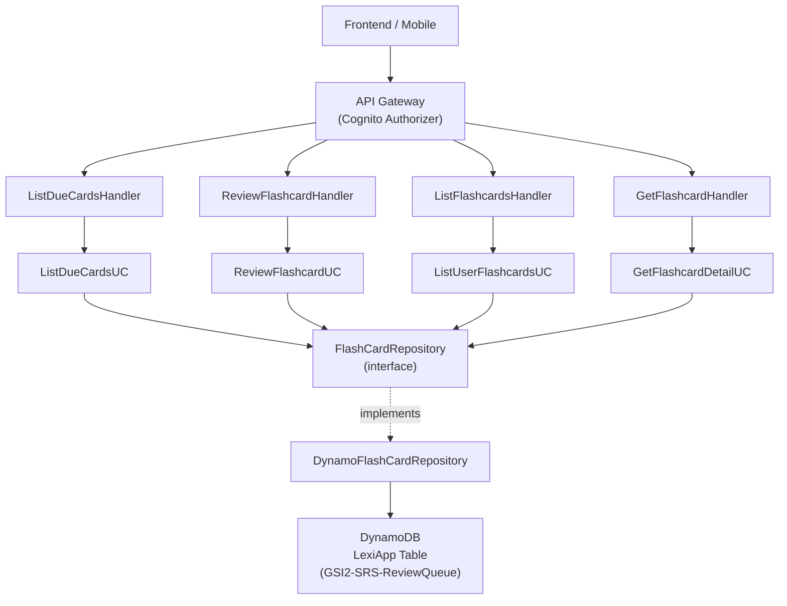
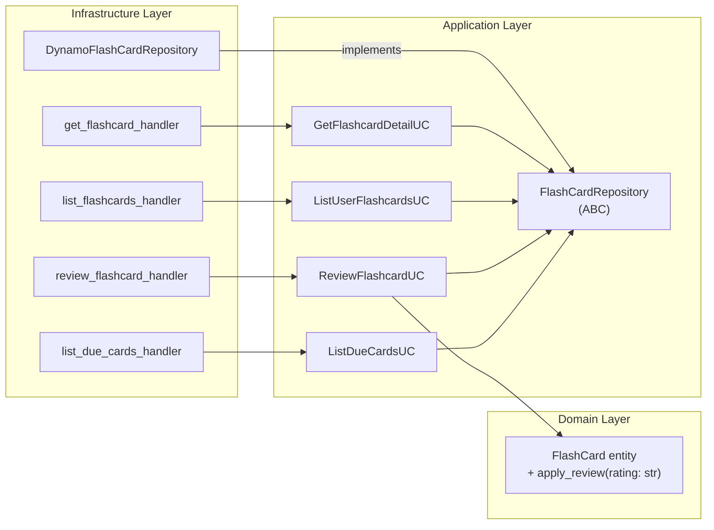

# Design: Flashcard Review SRS

## Overview

Feature này bổ sung hệ thống ôn tập flashcard theo thuật toán Spaced Repetition System (SRS) vào Lexi backend. Người học có thể xem thẻ đến hạn, đánh giá mức độ nhớ, và hệ thống tự động tính lịch ôn tiếp theo. Feature cũng cung cấp các endpoint để liệt kê toàn bộ flashcard và xem chi tiết từng thẻ.

Architecture style: **Clean Architecture** — domain entities, repository interfaces (ports), use cases (application layer), infrastructure implementations (adapters), và Lambda handlers (delivery layer).

---

## Architecture

### High-Level Diagram



### Component Diagram



---

## Data Models

### DynamoDB Item Structure (FlashCard)

| Attribute | Type | Value | Notes |
|---|---|---|---|
| `PK` | S | `FLASHCARD#{user_id}` | Partition key |
| `SK` | S | `CARD#{flashcard_id}` | Sort key |
| `GSI2PK` | S | `{user_id}` | GSI2 hash key — **currently missing, must be added** |
| `GSI2SK` | S | `{next_review_at}` | GSI2 range key (ISO 8601) — **currently missing, must be added** |
| `EntityType` | S | `FLASHCARD` | |
| `flashcard_id` | S | ULID | |
| `user_id` | S | Cognito sub | |
| `word` | S | | |
| `translation_vi` | S | | |
| `definition_vi` | S | | |
| `phonetic` | S | | |
| `audio_url` | S | | |
| `example_sentence` | S | | |
| `review_count` | N | | |
| `interval_days` | N | | |
| `difficulty` | N | 0–5 | |
| `last_reviewed_at` | S | ISO 8601 or null | |
| `next_review_at` | S | ISO 8601 | |
| `source_session_id` | S | optional | |
| `source_turn_index` | N | optional | |
| `created_at` | S | ISO 8601 | |
| `updated_at` | S | ISO 8601 | |

### GSI2 Key Mapping

```
GSI2PK = user_id                        (hash key — identifies the user)
GSI2SK = next_review_at (ISO 8601)      (range key — enables range query <= now)
```

ISO 8601 strings are lexicographically sortable, so `GSI2SK <= now_iso` works correctly as a DynamoDB KeyConditionExpression.

### Access Patterns

| Operation | Access Pattern | Index |
|---|---|---|
| List due cards for user | `GSI2PK = user_id AND GSI2SK <= now` | GSI2-SRS-ReviewQueue |
| List all cards for user (paginated) | `PK = FLASHCARD#{user_id} AND begins_with(SK, CARD#)` | Main table |
| Get card by user + ID | `PK = FLASHCARD#{user_id} AND SK = CARD#{flashcard_id}` | Main table |
| Save / update card | `PutItem` with PK + SK | Main table |

---

## SRS Algorithm Design

### Rating → Interval Mapping

The existing `update_srs(rating: int)` method on `FlashCard` uses integer ratings (0–5). This feature replaces it with `apply_review(rating: str)` using string ratings aligned with the business spec.

| Rating | New `interval_days` formula |
|---|---|
| `forgot` | `1` |
| `hard` | `max(1, round(current_interval_days * 1.2))` |
| `good` | `round(current_interval_days * 2.5)` |
| `easy` | `round(current_interval_days * 3.0)` |

### Post-Review Field Updates

```python
def apply_review(self, rating: str) -> None:
    VALID_RATINGS = {"forgot", "hard", "good", "easy"}
    if rating not in VALID_RATINGS:
        raise ValueError(f"Invalid rating '{rating}'. Must be one of: {VALID_RATINGS}")

    now = datetime.now(timezone.utc)
    old_interval = self.interval_days

    if rating == "forgot":
        new_interval = 1
    elif rating == "hard":
        new_interval = max(1, round(old_interval * 1.2))
    elif rating == "good":
        new_interval = round(old_interval * 2.5)
    else:  # easy
        new_interval = round(old_interval * 3.0)

    self.interval_days = new_interval
    self.last_reviewed_at = now
    self.next_review_at = now + timedelta(days=new_interval)
    self.review_count += 1
```

**Design decision:** `apply_review` replaces `update_srs` on the entity. The old method is kept temporarily to avoid breaking `CreateFlashCardUC`, but new code uses `apply_review` exclusively.

### Interval Ordering Invariant

For any card with `interval_days >= 1`:

```
interval_after_forgot (= 1)
  ≤ interval_after_hard (= max(1, round(current * 1.2)))
  ≤ interval_after_good (= round(current * 2.5))
  ≤ interval_after_easy (= round(current * 3.0))
```

This ordering holds for all `current >= 1`.

---

## API Design

All endpoints require a valid Cognito JWT in the `Authorization` header. `user_id` is extracted from the JWT `sub` claim via API Gateway authorizer context — never from path parameters.

### GET /flashcards/due

Returns all cards due for review (`next_review_at <= now`).

**Response 200:**
```json
{
  "cards": [
    {
      "flashcard_id": "01HXYZ...",
      "word": "serendipity",
      "translation_vi": "sự tình cờ may mắn",
      "definition_vi": "Sự khám phá điều tốt đẹp một cách tình cờ",
      "phonetic": "/ˌserənˈdɪpɪti/",
      "audio_url": "https://...",
      "example_sentence": "Finding that café was pure serendipity.",
      "review_count": 3,
      "interval_days": 4,
      "last_reviewed_at": "2025-01-10T08:00:00Z",
      "next_review_at": "2025-01-14T08:00:00Z"
    }
  ]
}
```

### POST /flashcards/{flashcard_id}/review

Submit a review rating for a card.

**Request body:**
```json
{ "rating": "good" }
```

**Response 200:**
```json
{
  "flashcard_id": "01HXYZ...",
  "word": "serendipity",
  "interval_days": 10,
  "review_count": 4,
  "last_reviewed_at": "2025-01-14T09:00:00Z",
  "next_review_at": "2025-01-24T09:00:00Z"
}
```

**Response 400:**
```json
{ "error": "Invalid rating. Must be one of: forgot, hard, good, easy" }
```

### GET /flashcards

List all flashcards with pagination.

**Query parameters:** `limit` (int, default 20, max 100), `last_key` (string, opaque cursor)

**Response 200:**
```json
{
  "cards": [ ... ],
  "next_key": "eyJQSyI6Ii4uLiJ9"
}
```

`next_key` is `null` when there are no more pages.

### GET /flashcards/{flashcard_id}

Get full details of a single card.

**Response 200:**
```json
{
  "flashcard_id": "01HXYZ...",
  "word": "serendipity",
  "translation_vi": "...",
  "definition_vi": "...",
  "phonetic": "...",
  "audio_url": "...",
  "example_sentence": "...",
  "review_count": 4,
  "interval_days": 10,
  "difficulty": 2,
  "last_reviewed_at": "2025-01-14T09:00:00Z",
  "next_review_at": "2025-01-24T09:00:00Z",
  "source_session_id": "01HABC...",
  "source_turn_index": 3
}
```

---

## Component Design (Low-Level)

### 1. FlashCard Entity — `apply_review` method

Add `apply_review(rating: str)` to `src/domain/entities/flashcard.py`. Keep `update_srs` intact to avoid breaking existing code.

### 2. Repository Interface — `src/application/repositories/flash_card_repository.py`

Add three abstract methods:

```python
@abstractmethod
def get_by_user_and_id(self, user_id: str, flashcard_id: str) -> Optional[FlashCard]:
    """Lấy thẻ theo user_id + flashcard_id (dùng PK + SK trực tiếp)."""
    ...

@abstractmethod
def list_by_user(
    self, user_id: str, last_key: Optional[dict], limit: int
) -> tuple[list[FlashCard], Optional[dict]]:
    """Liệt kê tất cả thẻ của user với pagination."""
    ...

@abstractmethod
def update(self, card: FlashCard) -> None:
    """Cập nhật thẻ đã tồn tại (bao gồm GSI2SK)."""
    ...
```

### 3. DynamoDB Repository — `src/infrastructure/persistence/dynamo_flashcard_repo.py`

**Fix `save()`** — thêm GSI2 keys:
```python
item["GSI2PK"] = card.user_id
item["GSI2SK"] = card.next_review_at.isoformat()
```

**Fix `list_due_cards()`** — dùng GSI2 query thay vì scan + filter:
```python
now = datetime.now(timezone.utc).isoformat()
response = self._table.query(
    IndexName="GSI2-SRS-ReviewQueue",
    KeyConditionExpression=Key("GSI2PK").eq(user_id) & Key("GSI2SK").lte(now),
)
```

**Add `get_by_user_and_id()`:**
```python
response = self._table.get_item(
    Key={"PK": f"FLASHCARD#{user_id}", "SK": f"CARD#{flashcard_id}"}
)
item = response.get("Item")
return self._to_entity(item) if item else None
```

**Add `list_by_user()`:**
```python
kwargs = {
    "KeyConditionExpression": Key("PK").eq(f"FLASHCARD#{user_id}") & Key("SK").begins_with("CARD#"),
    "Limit": limit,
}
if last_key:
    kwargs["ExclusiveStartKey"] = last_key
response = self._table.query(**kwargs)
cards = [self._to_entity(i) for i in response.get("Items", [])]
next_key = response.get("LastEvaluatedKey")
return cards, next_key
```

**Add `update()`:**
```python
def update(self, card: FlashCard) -> None:
    now = datetime.now(timezone.utc).isoformat()
    self._table.update_item(
        Key={"PK": f"FLASHCARD#{card.user_id}", "SK": f"CARD#{card.flashcard_id}"},
        UpdateExpression="""
            SET review_count = :rc,
                interval_days = :id,
                last_reviewed_at = :lr,
                next_review_at = :nr,
                GSI2SK = :nr,
                updated_at = :ua
        """,
        ExpressionAttributeValues={
            ":rc": card.review_count,
            ":id": card.interval_days,
            ":lr": card.last_reviewed_at.isoformat() if card.last_reviewed_at else None,
            ":nr": card.next_review_at.isoformat(),
            ":ua": now,
        },
    )
```

### 4. Use Cases — `src/application/use_cases/flashcard/`

**`list_due_cards_uc.py`:**
```python
class ListDueCardsUC:
    def __init__(self, repo: FlashCardRepository):
        self._repo = repo

    def execute(self, user_id: str) -> list[FlashCard]:
        return self._repo.list_due_cards(user_id)
```

**`review_flashcard_uc.py`:**
```python
class ReviewFlashcardUC:
    def __init__(self, repo: FlashCardRepository):
        self._repo = repo

    def execute(self, user_id: str, flashcard_id: str, rating: str) -> FlashCard:
        card = self._repo.get_by_user_and_id(user_id, flashcard_id)
        if card is None:
            raise KeyError(f"Flashcard {flashcard_id} not found")
        if card.user_id != user_id:
            raise PermissionError("Forbidden")
        card.apply_review(rating)   # raises ValueError for invalid rating
        self._repo.update(card)
        return card
```

**`list_user_flashcards_uc.py`:**
```python
class ListUserFlashcardsUC:
    def __init__(self, repo: FlashCardRepository):
        self._repo = repo

    def execute(
        self, user_id: str, last_key: Optional[dict], limit: int
    ) -> tuple[list[FlashCard], Optional[dict]]:
        return self._repo.list_by_user(user_id, last_key, limit)
```

**`get_flashcard_detail_uc.py`:**
```python
class GetFlashcardDetailUC:
    def __init__(self, repo: FlashCardRepository):
        self._repo = repo

    def execute(self, user_id: str, flashcard_id: str) -> FlashCard:
        card = self._repo.get_by_user_and_id(user_id, flashcard_id)
        if card is None:
            raise KeyError(f"Flashcard {flashcard_id} not found")
        if card.user_id != user_id:
            raise PermissionError("Forbidden")
        return card
```

### 5. Lambda Handlers — `src/infrastructure/handlers/flashcard/`

All handlers follow the same pattern as `create_flashcard_handler.py`:

- Extract `user_id` from `event["requestContext"]["authorizer"]["claims"]["sub"]`
- Return 401 if missing
- Delegate to use case
- Map exceptions to HTTP status codes:
  - `ValueError` → 400
  - `PermissionError` → 403
  - `KeyError` → 404
  - `Exception` → 500
- Include `Access-Control-Allow-Origin: *` in all responses

**`list_due_cards_handler.py`** — `GET /flashcards/due`

**`review_flashcard_handler.py`** — `POST /flashcards/{flashcard_id}/review`
- Parse `flashcard_id` from `event["pathParameters"]["flashcard_id"]`
- Parse `rating` from request body JSON

**`list_flashcards_handler.py`** — `GET /flashcards`
- Parse `limit` and `last_key` from `event["queryStringParameters"]`
- Decode `last_key` from base64 JSON if present

**`get_flashcard_handler.py`** — `GET /flashcards/{flashcard_id}`
- Parse `flashcard_id` from `event["pathParameters"]["flashcard_id"]`

### 6. SAM Template — `template.yaml`

Add four new Lambda functions:

```yaml
ListDueCardsFunction:
  Handler: infrastructure.handlers.flashcard.list_due_cards_handler.handler
  Events:
    ListDueCards:
      Path: /flashcards/due
      Method: GET
  Policies: DynamoDBReadPolicy

ReviewFlashcardFunction:
  Handler: infrastructure.handlers.flashcard.review_flashcard_handler.handler
  Events:
    ReviewFlashcard:
      Path: /flashcards/{flashcard_id}/review
      Method: POST
  Policies: DynamoDBCrudPolicy

ListFlashcardsFunction:
  Handler: infrastructure.handlers.flashcard.list_flashcards_handler.handler
  Events:
    ListFlashcards:
      Path: /flashcards
      Method: GET
  Policies: DynamoDBReadPolicy

GetFlashcardFunction:
  Handler: infrastructure.handlers.flashcard.get_flashcard_handler.handler
  Events:
    GetFlashcard:
      Path: /flashcards/{flashcard_id}
      Method: GET
  Policies: DynamoDBReadPolicy
```

All functions use `Runtime: python3.12` and `LEXI_TABLE_NAME` env var.

**Note on route ordering:** API Gateway resolves `/flashcards/due` before `/flashcards/{flashcard_id}` because static path segments take precedence over path parameters. No special configuration needed.

---

## Error Handling

| Scenario | HTTP Status | Response body |
|---|---|---|
| Missing / invalid JWT | 401 | `{"error": "Unauthorized"}` |
| Invalid rating value | 400 | `{"error": "Invalid rating. Must be one of: forgot, hard, good, easy"}` |
| Card belongs to another user | 403 | `{"error": "Forbidden"}` |
| Card not found | 404 | `{"error": "Flashcard not found"}` |
| Unexpected error | 500 | `{"error": "Internal server error"}` |

All responses include `Access-Control-Allow-Origin: *`.

Exception-to-status mapping in handlers:
```python
except ValueError as e:
    return error_response(400, str(e))
except PermissionError:
    return error_response(403, "Forbidden")
except KeyError:
    return error_response(404, "Flashcard not found")
except Exception as e:
    logger.error("Unexpected error: %s", e)
    return error_response(500, "Internal server error")
```

---

## Correctness Properties

*A property is a characteristic or behavior that should hold true across all valid executions of a system — essentially, a formal statement about what the system should do. Properties serve as the bridge between human-readable specifications and machine-verifiable correctness guarantees.*

Property-based testing is applicable here because the SRS algorithm is a pure function with clear input/output behavior, and the data access patterns have universal invariants that hold across all inputs. We use **Hypothesis** (Python) as the PBT library.

### Property Reflection

Before writing properties, reviewing for redundancy:

- 2.2–2.5 (individual rating formulas) + 2.6 (next_review_at) + 2.8 (review_count) can be combined into one comprehensive SRS update property that checks all fields at once for any valid rating.
- 1.1 (due cards filter) and 1.4 (response fields) can be combined: generate cards, call list_due_cards, verify both the filter and the field presence.
- 3.1 (pagination completeness) and 3.2 (page size limit) can be combined into one pagination property.
- 4.1 (round-trip) covers 4.4 (field completeness) — keep as one property.
- 2.9 (invalid rating rejection) is distinct and kept separate.

After reflection: 5 properties remain, each providing unique validation value.

---

### Property 1: SRS update correctness for all valid ratings

*For any* FlashCard with `interval_days >= 1` and any valid rating (`forgot`, `hard`, `good`, `easy`), calling `apply_review(rating)` SHALL:
- set `interval_days` according to the rating formula
- set `next_review_at = last_reviewed_at + timedelta(days=new_interval_days)`
- increment `review_count` by exactly 1
- result in `interval_days >= 1`

**Validates: Requirements 2.2, 2.3, 2.4, 2.5, 2.6, 2.7, 2.8**

---

### Property 2: SRS interval ordering invariant

*For any* FlashCard with `interval_days >= 1`, the resulting `interval_days` after applying each rating SHALL satisfy:

```
interval_after_forgot <= interval_after_hard <= interval_after_good <= interval_after_easy
```

**Validates: Requirements 2.2, 2.3, 2.4, 2.5**

---

### Property 3: Invalid rating always raises an error

*For any* string that is not one of `{"forgot", "hard", "good", "easy"}`, calling `apply_review(rating)` SHALL raise a `ValueError` and leave the card's state unchanged.

**Validates: Requirements 2.9**

---

### Property 4: Due cards filter correctness

*For any* user with any set of FlashCards (with varying `next_review_at` values), `list_due_cards(user_id)` SHALL return exactly the cards where `next_review_at <= now`, and no card with `next_review_at > now` SHALL appear in the result.

**Validates: Requirements 1.1, 1.2**

---

### Property 5: Flashcard save-retrieve round trip

*For any* valid FlashCard, saving it with `save()` and then retrieving it with `get_by_user_and_id(user_id, flashcard_id)` SHALL return a card with identical field values (`word`, `translation_vi`, `definition_vi`, `phonetic`, `interval_days`, `review_count`, `next_review_at`).

**Validates: Requirements 4.1, 4.4**

---

## Testing Strategy

### Dual Testing Approach

**Unit / property tests** (Hypothesis, minimum 100 iterations per property):
- Test the `FlashCard.apply_review()` method in isolation (Properties 1, 2, 3)
- Test `DynamoFlashCardRepository` with a mocked DynamoDB table (Properties 4, 5)
- Example-based tests for 401/403/404/500 error cases

**Integration tests** (1–3 examples each):
- Verify GSI2PK and GSI2SK are populated on `save()`
- Verify `list_due_cards` uses GSI2 query (not scan)
- Verify handler routing and Cognito JWT extraction

### Property Test Configuration

```python
# Example: Property 1
from hypothesis import given, settings
from hypothesis import strategies as st

@given(
    interval_days=st.integers(min_value=1, max_value=365),
    rating=st.sampled_from(["forgot", "hard", "good", "easy"]),
)
@settings(max_examples=200)
def test_srs_update_correctness(interval_days, rating):
    # Feature: flashcard-review-srs, Property 1: SRS update correctness for all valid ratings
    card = make_card(interval_days=interval_days)
    old_count = card.review_count
    card.apply_review(rating)
    assert card.interval_days >= 1
    assert card.review_count == old_count + 1
    assert card.next_review_at > card.last_reviewed_at
    expected = compute_expected_interval(interval_days, rating)
    assert card.interval_days == expected
```

Tag format for all property tests:
```
# Feature: flashcard-review-srs, Property {N}: {property_title}
```

### Unit Test Focus Areas

- `apply_review` with each of the 4 valid ratings and specific interval values
- `apply_review` with invalid rating strings (empty string, `"medium"`, `"5"`, etc.)
- Handler error mapping: `ValueError` → 400, `PermissionError` → 403, `KeyError` → 404
- Pagination: `last_key` encoding/decoding, `limit` clamping to max 100
