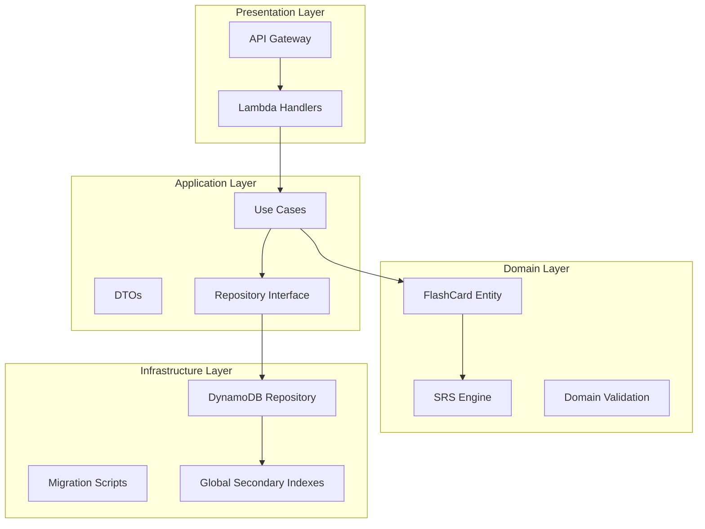

# Flashcard System Upgrade Design Document

## Overview

This design document outlines the comprehensive upgrade of the flashcard system to implement a scientifically-proven Spaced Repetition System (SRS) using the SM-2 algorithm, improve data access performance, add missing CRUD operations, and provide learning progress tracking capabilities.

### Current System Limitations

The existing flashcard system has several critical issues:
- **Algorithmic Flaws**: Uses a simplified SRS that doesn't follow proven algorithms
- **Performance Issues**: Uses SCAN operations for word lookup, causing delays
- **Missing Functionality**: Lacks UPDATE/DELETE operations, bulk import/export, and statistics
- **Data Model Gaps**: Missing ease_factor and repetition_count fields required for proper SRS

### Design Goals

1. **Scientific Accuracy**: Implement the SM-2 algorithm exactly as specified
2. **Performance**: Sub-100ms response times for review operations
3. **Completeness**: Full CRUD operations with bulk import/export
4. **Analytics**: Comprehensive learning statistics and search capabilities
5. **Backward Compatibility**: Seamless migration of existing data

## Architecture

### High-Level Architecture

The system follows Clean Architecture principles with clear separation of concerns:



### Component Responsibilities

- **SRS Engine**: Implements SM-2 algorithm for calculating review intervals
- **FlashCard Entity**: Domain model with business logic and validation
- **Repository**: Data access abstraction with performance-optimized queries
- **Use Cases**: Application logic orchestrating domain operations
- **Migration Scripts**: Safe transformation of existing data to new schema

## Components and Interfaces

### SRS Engine Component

The SRS Engine implements the SM-2 algorithm as a pure domain service:

```python
class SRSEngine:
    """
    Implements the SM-2 spaced repetition algorithm.
    
    The SM-2 algorithm calculates optimal review intervals based on:
    - ease_factor: Difficulty multiplier (1.3 to 2.5)
    - repetition_count: Number of consecutive successful reviews
    - quality: User's recall assessment (0-5)
    """
    
    @staticmethod
    def calculate_next_interval(
        quality: int,
        repetition_count: int,
        ease_factor: float,
        previous_interval: int
    ) -> tuple[int, int, float]:
        """
        Calculate next review interval using SM-2 algorithm.
        
        Returns: (new_interval, new_repetition_count, new_ease_factor)
        """
        
    @staticmethod
    def map_rating_to_quality(rating: str) -> int:
        """Map string ratings to SM-2 quality values."""
        
    @staticmethod
    def update_ease_factor(current_ef: float, quality: int) -> float:
        """Update ease factor based on recall quality."""
```

### Enhanced FlashCard Entity

The FlashCard entity is enhanced with SM-2 algorithm support:

```python
@dataclass
class FlashCard:
    # Existing fields
    flashcard_id: str
    user_id: str
    word: str
    translation_vi: str
    phonetic: str
    audio_url: str
    example_sentence: str
    
    # Enhanced SRS fields
    ease_factor: float = 2.5          # SM-2 ease factor (1.3-2.5)
    repetition_count: int = 0         # Consecutive successful reviews
    interval_days: int = 1            # Days until next review
    review_count: int = 0             # Total reviews (for statistics)
    difficulty: int = 0               # Legacy field (maintained for compatibility)
    
    # Timestamps
    last_reviewed_at: Optional[datetime] = None
    next_review_at: datetime = field(default_factory=lambda: datetime.now(timezone.utc))
    
    def apply_sm2_review(self, rating: str) -> None:
        """Apply SM-2 algorithm based on user rating."""
        quality = SRSEngine.map_rating_to_quality(rating)
        
        new_interval, new_repetition_count, new_ease_factor = SRSEngine.calculate_next_interval(
            quality=quality,
            repetition_count=self.repetition_count,
            ease_factor=self.ease_factor,
            previous_interval=self.interval_days
        )
        
        self.interval_days = new_interval
        self.repetition_count = new_repetition_count
        self.ease_factor = new_ease_factor
        self.last_reviewed_at = datetime.now(timezone.utc)
        self.next_review_at = self.last_reviewed_at + timedelta(days=new_interval)
        self.review_count += 1
```

### Enhanced Repository Interface

The repository interface is extended with new operations:

```python
class FlashCardRepository(ABC):
    # Existing methods
    @abstractmethod
    def save(self, card: FlashCard) -> None: ...
    
    @abstractmethod
    def get_by_user_and_id(self, user_id: str, flashcard_id: str) -> Optional[FlashCard]: ...
    
    @abstractmethod
    def list_due_cards(self, user_id: str) -> List[FlashCard]: ...
    
    # New methods for enhanced functionality
    @abstractmethod
    def update_content(self, user_id: str, flashcard_id: str, updates: dict) -> FlashCard: ...
    
    @abstractmethod
    def delete(self, user_id: str, flashcard_id: str) -> bool: ...
    
    @abstractmethod
    def get_by_user_and_word_efficient(self, user_id: str, word: str) -> Optional[FlashCard]: ...
    
    @abstractmethod
    def export_user_flashcards(self, user_id: str, cursor: Optional[str] = None) -> tuple[List[dict], Optional[str]]: ...
    
    @abstractmethod
    def import_flashcards(self, user_id: str, flashcards: List[dict]) -> ImportResult: ...
    
    @abstractmethod
    def get_user_statistics(self, user_id: str) -> FlashcardStatistics: ...
    
    @abstractmethod
    def search_flashcards(self, user_id: str, filters: SearchFilters) -> SearchResult: ...
```

### New Use Cases

Several new use cases are added to support the enhanced functionality:

```python
class UpdateFlashcardUseCase:
    """Update flashcard content while preserving SRS data."""
    
class DeleteFlashcardUseCase:
    """Delete a flashcard with proper authorization."""
    
class ExportFlashcardsUseCase:
    """Export user flashcards to JSON format."""
    
class ImportFlashcardsUseCase:
    """Import flashcards from JSON with validation."""
    
class GetStatisticsUseCase:
    """Generate learning progress statistics."""
    
class SearchFlashcardsUseCase:
    """Search and filter flashcards with pagination."""
```

## Data Models

### DynamoDB Schema Enhancement

The existing DynamoDB schema is enhanced with a new GSI for efficient word lookup:

#### Primary Table Structure
```
PK: FLASHCARD#{user_id}
SK: CARD#{flashcard_id}
GSI2PK: {user_id}                    # For due cards query
GSI2SK: {next_review_at}             # For due cards query
GSI3PK: {user_id}                    # NEW: For word lookup
GSI3SK: {word_lowercase}             # NEW: For word lookup
```

#### New GSI3 for Word Lookup
```yaml
GSI3-WordLookup:
  KeySchema:
    - AttributeName: GSI3PK
      KeyType: HASH
    - AttributeName: GSI3SK  
      KeyType: RANGE
  Projection:
    ProjectionType: INCLUDE
    NonKeyAttributes:
      - flashcard_id
      - word
      - translation_vi
      - ease_factor
      - repetition_count
```

#### Enhanced Item Structure
```json
{
  "PK": "FLASHCARD#{user_id}",
  "SK": "CARD#{flashcard_id}",
  "GSI2PK": "{user_id}",
  "GSI2SK": "{next_review_at}",
  "GSI3PK": "{user_id}",
  "GSI3SK": "{word_lowercase}",
  "EntityType": "FLASHCARD",
  "flashcard_id": "string",
  "user_id": "string", 
  "word": "string",
  "translation_vi": "string",
  "phonetic": "string",
  "audio_url": "string",
  "example_sentence": "string",
  "ease_factor": 2.5,
  "repetition_count": 0,
  "interval_days": 1,
  "review_count": 0,
  "difficulty": 0,
  "last_reviewed_at": "ISO8601",
  "next_review_at": "ISO8601",
  "created_at": "ISO8601",
  "updated_at": "ISO8601"
}
```

### API Data Models

#### Request/Response DTOs

```python
@dataclass
class UpdateFlashcardRequest:
    translation_vi: Optional[str] = None
    phonetic: Optional[str] = None
    audio_url: Optional[str] = None
    example_sentence: Optional[str] = None

@dataclass
class FlashcardStatistics:
    total_count: int
    due_today_count: int
    reviewed_last_7_days: int
    maturity_counts: dict[str, int]  # new/learning/mature
    average_ease_factor: float

@dataclass
class SearchFilters:
    word_prefix: Optional[str] = None
    min_interval: Optional[int] = None
    max_interval: Optional[int] = None
    maturity_level: Optional[str] = None  # new/learning/mature

@dataclass
class ImportResult:
    imported_count: int
    skipped_count: int
    failed_count: int
    errors: List[str]
```

## Algorithm Design

### SM-2 Algorithm Implementation

The SM-2 algorithm is implemented exactly as specified in the SuperMemo documentation:

```python
class SRSEngine:
    @staticmethod
    def calculate_next_interval(
        quality: int,
        repetition_count: int, 
        ease_factor: float,
        previous_interval: int
    ) -> tuple[int, int, float]:
        """
        SM-2 Algorithm Implementation
        
        Args:
            quality: 0-5 (0=forgot, 3=hard, 4=good, 5=easy)
            repetition_count: Number of consecutive successful reviews
            ease_factor: Current ease factor (1.3-2.5)
            previous_interval: Previous interval in days
            
        Returns:
            (new_interval, new_repetition_count, new_ease_factor)
        """
        # Update ease factor
        new_ease_factor = ease_factor + (0.1 - (5 - quality) * (0.08 + (5 - quality) * 0.02))
        new_ease_factor = max(1.3, new_ease_factor)  # Minimum EF = 1.3
        
        if quality < 3:
            # Failed recall - reset repetition count
            new_repetition_count = 0
            new_interval = 1
        else:
            # Successful recall
            new_repetition_count = repetition_count + 1
            
            if new_repetition_count == 1:
                new_interval = 1
            elif new_repetition_count == 2:
                new_interval = 6
            else:
                new_interval = round(previous_interval * new_ease_factor)
        
        return new_interval, new_repetition_count, new_ease_factor
    
    @staticmethod
    def map_rating_to_quality(rating: str) -> int:
        """Map string ratings to SM-2 quality values."""
        mapping = {
            "forgot": 0,
            "hard": 3, 
            "good": 4,
            "easy": 5
        }
        if rating not in mapping:
            raise ValueError(f"Invalid rating: {rating}")
        return mapping[rating]
```

### Performance Optimization Strategy

1. **GSI-Based Queries**: Replace SCAN operations with targeted GSI queries
2. **Batch Operations**: Use DynamoDB batch operations for bulk import/export
3. **Projection Optimization**: Include only necessary attributes in GSI projections
4. **Connection Pooling**: Reuse DynamoDB connections across Lambda invocations

## Migration Strategy

### Safe Data Migration Process

The migration follows a zero-downtime approach:

```python
class FlashcardMigrationScript:
    """
    Migrates existing flashcards to new schema with SM-2 support.
    
    Migration Steps:
    1. Add ease_factor field (default: 2.5)
    2. Add repetition_count field (derived from review_count)
    3. Create GSI3 entries for word lookup
    4. Validate data integrity
    """
    
    def migrate_flashcards(self):
        """Execute migration in batches of 25 items."""
        
    def derive_repetition_count(self, review_count: int) -> int:
        """Derive repetition_count from existing review_count."""
        # Conservative approach: assume max 3 consecutive successes
        return min(review_count, 3)
        
    def create_gsi3_entry(self, item: dict) -> dict:
        """Add GSI3 fields for word lookup."""
        item["GSI3PK"] = item["user_id"]
        item["GSI3SK"] = item["word"].lower()
        return item
```

### Migration Validation

```python
class MigrationValidator:
    """Validates migration results."""
    
    def validate_migration(self):
        """
        Validation checks:
        1. All flashcards have ease_factor and repetition_count
        2. GSI3 entries exist for all flashcards
        3. No data loss occurred
        4. SRS calculations work correctly
        """
```

## API Design

### RESTful Endpoints

#### Enhanced Flashcard Operations

```
POST   /flashcards                    # Create flashcard
GET    /flashcards/{id}              # Get flashcard details  
PATCH  /flashcards/{id}              # Update flashcard content
DELETE /flashcards/{id}              # Delete flashcard
POST   /flashcards/{id}/review       # Review flashcard (existing)
GET    /flashcards                   # List/search flashcards
GET    /flashcards/due               # List due flashcards (existing)
```

#### New Bulk Operations

```
GET    /flashcards/export            # Export all flashcards
POST   /flashcards/import            # Import flashcards from JSON
```

#### New Analytics Endpoints

```
GET    /flashcards/statistics        # Get learning statistics
```

### Request/Response Examples

#### Update Flashcard Content
```http
PATCH /flashcards/{flashcard_id}
Authorization: Bearer {token}
Content-Type: application/json

{
  "translation_vi": "Updated translation",
  "example_sentence": "New example sentence"
}
```

Response:
```json
{
  "flashcard_id": "01HXXX...",
  "word": "example",
  "translation_vi": "Updated translation", 
  "phonetic": "/ɪɡˈzæmpəl/",
  "audio_url": "https://...",
  "example_sentence": "New example sentence",
  "ease_factor": 2.5,
  "repetition_count": 0,
  "interval_days": 1,
  "next_review_at": "2024-01-15T10:00:00Z"
}
```

#### Export Flashcards
```http
GET /flashcards/export?cursor={optional_cursor}
Authorization: Bearer {token}
```

Response:
```json
{
  "flashcards": [
    {
      "word": "example",
      "translation_vi": "ví dụ",
      "phonetic": "/ɪɡˈzæmpəl/",
      "audio_url": "https://...",
      "example_sentence": "This is an example.",
      "ease_factor": 2.5,
      "repetition_count": 0,
      "interval_days": 1,
      "review_count": 0,
      "last_reviewed_at": null,
      "next_review_at": "2024-01-15T10:00:00Z"
    }
  ],
  "next_cursor": "eyJ..."
}
```

#### Import Flashcards
```http
POST /flashcards/import
Authorization: Bearer {token}
Content-Type: application/json

{
  "flashcards": [
    {
      "word": "hello",
      "translation_vi": "xin chào",
      "phonetic": "/həˈloʊ/",
      "example_sentence": "Hello, world!"
    }
  ]
}
```

Response:
```json
{
  "imported_count": 1,
  "skipped_count": 0,
  "failed_count": 0,
  "errors": []
}
```

#### Learning Statistics
```http
GET /flashcards/statistics
Authorization: Bearer {token}
```

Response:
```json
{
  "total_count": 150,
  "due_today_count": 12,
  "reviewed_last_7_days": 45,
  "maturity_counts": {
    "new": 20,
    "learning": 50, 
    "mature": 80
  },
  "average_ease_factor": 2.3
}
```

#### Search Flashcards
```http
GET /flashcards?word_prefix=ex&maturity_level=learning&limit=20&cursor={optional}
Authorization: Bearer {token}
```

Response:
```json
{
  "flashcards": [...],
  "next_cursor": "eyJ...",
  "total_count": 5
}
```

## Correctness Properties

*A property is a characteristic or behavior that should hold true across all valid executions of a system-essentially, a formal statement about what the system should do. Properties serve as the bridge between human-readable specifications and machine-verifiable correctness guarantees.*

### Property 1: SM-2 Algorithm Correctness

*For any* valid combination of quality rating (0-5), repetition count, ease factor (1.3-2.5), and previous interval, the SM-2 algorithm SHALL calculate the next interval, repetition count, and ease factor according to the SuperMemo specification

**Validates: Requirements 1.1, 1.3, 1.4, 1.5, 1.6, 1.7, 1.8**

### Property 2: Flashcard Initialization

*For any* new flashcard creation, the SRS engine SHALL initialize ease_factor to 2.5 and repetition_count to 0

**Validates: Requirements 1.2**

### Property 3: Rating Mapping Consistency

*For any* valid string rating ("forgot", "hard", "good", "easy"), the SRS engine SHALL consistently map to the correct quality values (0, 3, 4, 5 respectively)

**Validates: Requirements 1.9**

### Property 4: Persistence Round-Trip

*For any* valid flashcard with ease_factor and repetition_count, persisting then retrieving SHALL preserve these values exactly

**Validates: Requirements 2.4, 2.5**

### Property 5: Word Normalization Consistency

*For any* word with mixed case, the repository SHALL normalize to lowercase before querying and produce consistent results regardless of input case

**Validates: Requirements 3.4**

### Property 6: Partial Update Preservation

*For any* flashcard and any subset of updatable fields, updating SHALL modify only the specified fields while preserving all other data including SRS state

**Validates: Requirements 4.4**

### Property 7: Export Completeness

*For any* valid flashcard, the export function SHALL include all required fields (word, translation_vi, phonetic, audio_url, example_sentence, ease_factor, repetition_count, interval_days, review_count, last_reviewed_at, next_review_at)

**Validates: Requirements 6.3**

### Property 8: Import Duplicate Handling

*For any* import batch containing flashcards with duplicate words, the system SHALL skip existing words and continue processing remaining flashcards without errors

**Validates: Requirements 7.3**

### Property 9: Multi-Word Validation

*For any* word containing spaces, hyphens, or apostrophes, the flashcard system SHALL accept the word as valid input

**Validates: Requirements 11.1, 11.2, 11.3**

### Property 10: Whitespace Rejection

*For any* string containing only whitespace characters, the flashcard system SHALL reject it as an invalid word

**Validates: Requirements 11.5**

### Property 11: Whitespace Trimming

*For any* word with leading or trailing whitespace, the flashcard system SHALL trim the whitespace and store the cleaned word

**Validates: Requirements 11.6**

### Property 12: Export-Import Round-Trip

*For any* valid set of flashcards, exporting then importing SHALL produce equivalent flashcards with identical content and preserved SRS state (ease_factor, repetition_count, interval_days, next_review_at within 1 second tolerance)

**Validates: Requirements 13.1, 13.4**

## Error Handling

### Validation Strategy

The system implements comprehensive validation at multiple layers:

1. **Domain Layer Validation**
   - FlashCard entity validates required fields and constraints
   - SRS Engine validates algorithm inputs (quality 0-5, ease_factor 1.3-2.5)
   - Word validation (length, content, whitespace handling)

2. **Application Layer Validation**
   - Use cases validate business rules and authorization
   - DTOs validate request structure and data types
   - Import validation checks JSON schema compliance

3. **Infrastructure Layer Validation**
   - Repository validates DynamoDB constraints
   - API handlers validate HTTP request format
   - Migration scripts validate data integrity

### Error Response Format

All API endpoints return consistent error responses:

```json
{
  "error": {
    "code": "VALIDATION_ERROR",
    "message": "Word cannot be empty or contain only whitespace",
    "details": {
      "field": "word",
      "provided_value": "   ",
      "constraint": "non_empty_after_trim"
    }
  }
}
```

### Error Categories

1. **Validation Errors (400)**
   - Invalid word format
   - Missing required fields
   - Invalid rating values
   - JSON schema violations

2. **Authorization Errors (403)**
   - User attempting to access another user's flashcards
   - Invalid JWT token

3. **Not Found Errors (404)**
   - Flashcard does not exist
   - User not found

4. **Conflict Errors (409)**
   - Duplicate word for user
   - Concurrent modification conflicts

5. **System Errors (500)**
   - DynamoDB service errors
   - Lambda timeout errors
   - Unexpected algorithm failures

### Retry and Recovery

1. **Idempotent Operations**
   - All write operations are designed to be safely retryable
   - Migration scripts can be run multiple times safely

2. **Graceful Degradation**
   - Statistics endpoint falls back to approximate counts if exact calculation times out
   - Search functionality continues with partial results if some filters fail

3. **Circuit Breaker Pattern**
   - DynamoDB operations implement exponential backoff
   - Bulk operations are batched to prevent throttling

## Testing Strategy

### Dual Testing Approach

The testing strategy combines property-based testing for algorithmic correctness with example-based testing for specific business scenarios:

**Property-Based Testing (using Hypothesis for Python)**:
- **SM-2 Algorithm**: Test with 100+ random combinations of quality, repetition_count, ease_factor
- **Serialization**: Test round-trip persistence with randomly generated flashcards
- **Validation**: Test input validation with randomly generated valid/invalid inputs
- **Export/Import**: Test round-trip with randomly generated flashcard sets
- **Minimum 100 iterations per property test**
- **Tag format**: `# Feature: flashcard-system-upgrade, Property {number}: {property_text}`

**Example-Based Unit Testing**:
- **CRUD Operations**: Test specific scenarios (create, read, update, delete)
- **Authorization**: Test access control with specific user/flashcard combinations
- **API Endpoints**: Test request/response formats with known data
- **Edge Cases**: Test boundary conditions (empty lists, maximum values)
- **Error Handling**: Test specific error scenarios

**Integration Testing**:
- **DynamoDB Operations**: Test with real DynamoDB Local instance
- **Performance Requirements**: Verify sub-100ms response times
- **Migration Scripts**: Test with representative production data samples
- **End-to-End Workflows**: Test complete user journeys

### Test Configuration

```python
# Property-based test example
@given(
    quality=integers(min_value=0, max_value=5),
    repetition_count=integers(min_value=0, max_value=100),
    ease_factor=floats(min_value=1.3, max_value=2.5),
    previous_interval=integers(min_value=1, max_value=365)
)
def test_sm2_algorithm_correctness(quality, repetition_count, ease_factor, previous_interval):
    """
    Feature: flashcard-system-upgrade, Property 1: SM-2 Algorithm Correctness
    
    For any valid combination of quality rating (0-5), repetition count, ease factor (1.3-2.5), 
    and previous interval, the SM-2 algorithm SHALL calculate the next interval, repetition count, 
    and ease factor according to the SuperMemo specification
    """
    # Test implementation
```

### Performance Testing

- **Load Testing**: Simulate 1000 concurrent users reviewing flashcards
- **Stress Testing**: Test with users having 10,000+ flashcards
- **Latency Testing**: Verify 95th percentile response times meet requirements
- **DynamoDB Capacity**: Test with various read/write capacity configurations

### Migration Testing

- **Data Integrity**: Verify no data loss during migration
- **Backward Compatibility**: Ensure existing functionality continues to work
- **Rollback Testing**: Test ability to rollback migration if needed
- **Performance Impact**: Verify migration doesn't affect production performance

## Implementation Roadmap

### Phase 1: Core Algorithm (Week 1-2)
1. Implement SRS Engine with SM-2 algorithm
2. Enhance FlashCard entity with new fields
3. Add property-based tests for algorithm correctness
4. Update existing review functionality

### Phase 2: Data Layer Enhancement (Week 3-4)
1. Add GSI3 for efficient word lookup
2. Implement enhanced repository methods
3. Create migration scripts with validation
4. Add integration tests for data operations

### Phase 3: CRUD Operations (Week 5-6)
1. Implement update and delete use cases
2. Add API endpoints for CRUD operations
3. Implement authorization and validation
4. Add comprehensive error handling

### Phase 4: Bulk Operations (Week 7-8)
1. Implement export/import functionality
2. Add pagination and cursor-based navigation
3. Implement JSON schema validation
4. Add round-trip property tests

### Phase 5: Analytics and Search (Week 9-10)
1. Implement statistics calculation
2. Add search and filtering capabilities
3. Optimize query performance
4. Add comprehensive monitoring

### Phase 6: Migration and Deployment (Week 11-12)
1. Execute production data migration
2. Deploy new functionality with feature flags
3. Monitor performance and error rates
4. Complete rollout and documentation

## Deployment Strategy

### Blue-Green Deployment

1. **Preparation Phase**
   - Deploy new Lambda functions alongside existing ones
   - Create GSI3 without affecting existing queries
   - Run migration scripts in read-only mode for validation

2. **Migration Phase**
   - Execute data migration during low-traffic period
   - Validate migration results with automated tests
   - Enable new GSI3 for queries

3. **Rollout Phase**
   - Gradually route traffic to new Lambda functions
   - Monitor error rates and performance metrics
   - Rollback capability maintained throughout

4. **Cleanup Phase**
   - Remove old Lambda function versions
   - Clean up temporary migration resources
   - Update documentation and monitoring

### Monitoring and Alerting

1. **Performance Metrics**
   - API response times (95th percentile < 100ms for reviews)
   - DynamoDB read/write capacity utilization
   - Lambda function duration and error rates

2. **Business Metrics**
   - Daily active users reviewing flashcards
   - Average review session length
   - SM-2 algorithm effectiveness (retention rates)

3. **Error Monitoring**
   - Algorithm calculation failures
   - Data validation errors
   - Authorization failures
   - DynamoDB throttling events

### Rollback Plan

1. **Immediate Rollback Triggers**
   - Error rate > 1% for core operations
   - Response time degradation > 50%
   - Data corruption detected

2. **Rollback Procedure**
   - Route traffic back to previous Lambda versions
   - Disable new GSI3 queries
   - Restore from DynamoDB point-in-time backup if needed
   - Communicate status to stakeholders

This comprehensive design ensures a robust, performant, and scientifically accurate flashcard system that will significantly improve the learning experience while maintaining backward compatibility and operational excellence.