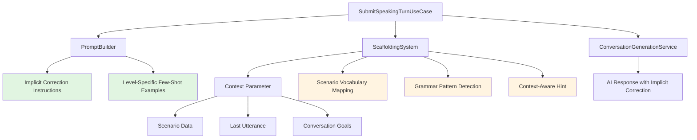
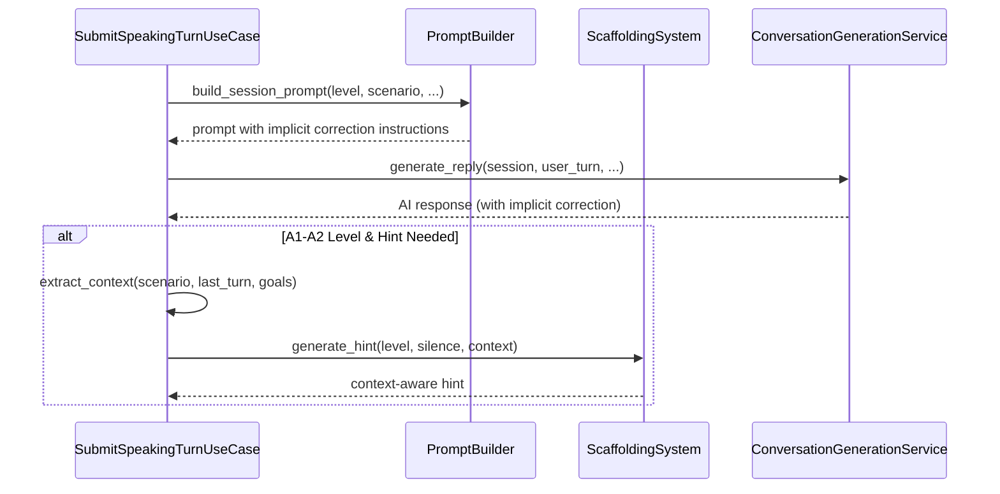

# Design Document: Quick Wins - Implicit Error Correction & Context-Aware Scaffolding

## Overview

This design implements two pedagogically-effective improvements to the Lexi conversation system:

1. **Implicit Error Correction**: AI models correct usage naturally in responses without explicit correction statements
2. **Context-Aware Scaffolding**: Hints leverage scenario vocabulary, learner mistakes, and conversation goals

### Design Goals

- **Pedagogical Effectiveness**: Natural error modeling improves learning outcomes
- **Contextual Relevance**: Hints reference actual scenario vocabulary and learner struggles
- **Backward Compatibility**: No breaking changes to existing APIs or sessions
- **Minimal Complexity**: Simple heuristics, no ML models, 1-2 week implementation

### Key Constraints

- Maintain existing API contracts (no breaking changes)
- Support all CEFR levels (A1-C2) with level-appropriate correction
- Fallback to generic hints when context unavailable
- No external dependencies or ML models

## Architecture

### Component Interaction



### Data Flow



### Backward Compatibility Strategy

**No Breaking Changes**:
- `PromptBuilder.build_session_prompt()` signature unchanged
- `ScaffoldingSystem.generate_hint()` accepts optional `context` parameter
- `SubmitSpeakingTurnUseCase` maintains existing API contracts
- All new parameters have default values (None, empty dict)

**Graceful Degradation**:
- When context unavailable → generic hints
- When scenario not in mapping → fallback vocabulary
- When pattern detection fails → generic hints

## Components and Interfaces

### 1. PromptBuilder Enhancement

**File**: `src/domain/services/prompt_builder.py`

**Changes**:
- Add implicit correction instructions to prompt
- Add level-specific few-shot examples (A1-C2)
- Maintain existing method signatures

**New Constants**:

```python
# Implicit correction instructions per level
_IMPLICIT_CORRECTION_INSTRUCTIONS = {
    "A1": "When learner makes grammar/vocabulary mistakes, model correct usage naturally in your response. Example: Learner says 'I go beach yesterday' → You respond 'When you went to the beach, did you swim?'",
    "A2": "When learner makes mistakes, naturally model correct forms in your response without explicit correction. Continue conversation naturally.",
    # ... B1-C2
}

# Few-shot examples with implicit correction
_IMPLICIT_CORRECTION_EXAMPLES = {
    "A1": """
Example (Implicit Correction):
Learner: "I go beach yesterday"
Good: "[warmly] When you went to the beach, did you swim?"
Bad: "You should say 'went', not 'go'. The correct form is..."
""",
    # ... A2-C2
}
```

**Modified Method**:

```python
def build_session_prompt(
    scenario_title: str,
    context: str,
    learner_role: str,
    ai_role: str,
    level: str,
    selected_goals: list[str],
    ai_gender: str,
    prompt_version: str = "v1",
) -> str:
    """Build session prompt with implicit correction instructions."""
    # Existing logic...
    
    # Add implicit correction instructions
    implicit_correction_instruction = _IMPLICIT_CORRECTION_INSTRUCTIONS.get(level, "")
    implicit_correction_examples = _IMPLICIT_CORRECTION_EXAMPLES.get(level, "")
    
    # Append to existing prompt
    return (
        f"{existing_prompt}\n\n"
        f"IMPLICIT ERROR CORRECTION:\n"
        f"{implicit_correction_instruction}\n\n"
        f"{implicit_correction_examples}"
    )
```

### 2. ScaffoldingSystem Enhancement

**File**: `src/domain/services/scaffolding_system.py`

**Changes**:
- Add `context` parameter to `generate_hint()`
- Add scenario vocabulary mappings
- Add grammar pattern detection heuristics
- Generate context-aware hints

**New Data Structures**:

```python
@dataclass
class ScaffoldingContext:
    """Context for generating context-aware hints."""
    scenario_title: Optional[str] = None
    scenario_vocabulary: Optional[List[str]] = None
    last_utterance: Optional[str] = None
    conversation_goals: Optional[List[str]] = None
```

**New Constants**:

```python
# Scenario vocabulary mappings (A1-A2 level)
_SCENARIO_VOCABULARY = {
    "Restaurant": {
        "questions": ["Can I have...", "What do you recommend?", "How much is..."],
        "statements": ["I'd like to order...", "This looks delicious", "The bill, please"],
    },
    "Airport": {
        "questions": ["Where is gate...?", "When does the flight leave?", "Can I check in?"],
        "statements": ["I need to check in", "Here's my passport", "I have luggage"],
    },
    # ... Hotel, Shopping, etc.
}

# Grammar pattern keywords
_GRAMMAR_PATTERNS = {
    "past_tense": ["yesterday", "last", "ago", "was", "were"],
    "present_tense": ["now", "today", "always", "usually"],
    "question": ["what", "where", "when", "why", "how", "?"],
}
```

**Modified Method**:

```python
def generate_hint(
    self,
    proficiency_level: str,
    silence_duration_seconds: int,
    context: Optional[dict] = None,  # NEW PARAMETER
) -> Optional[BilingualHint]:
    """Generate context-aware bilingual hint."""
    if not self.should_provide_hint(silence_duration_seconds, proficiency_level):
        return None
    
    hint_level = self.get_hint_level(silence_duration_seconds)
    
    # Generate context-aware hint if context provided
    if context:
        return self._generate_context_aware_hint(
            proficiency_level, hint_level, context
        )
    
    # Fallback to generic hint (backward compatibility)
    return self._generate_generic_hint(proficiency_level, hint_level)
```

**New Methods**:

```python
def _generate_context_aware_hint(
    self,
    proficiency_level: str,
    hint_level: HintLevel,
    context: dict,
) -> BilingualHint:
    """Generate hint using scenario and learner context."""
    scenario_title = context.get("scenario_title", "")
    last_utterance = context.get("last_utterance", "")
    
    # Get scenario-specific vocabulary
    vocabulary = self._get_scenario_vocabulary(scenario_title)
    
    # Detect grammar patterns in last utterance
    grammar_pattern = self._detect_grammar_pattern(last_utterance)
    
    # Generate hint based on level and context
    if hint_level == HintLevel.VOCABULARY_HINT:
        return self._generate_vocabulary_hint_with_context(
            proficiency_level, vocabulary, grammar_pattern
        )
    elif hint_level == HintLevel.SENTENCE_STARTER:
        return self._generate_sentence_starter_with_context(
            proficiency_level, vocabulary, grammar_pattern
        )
    else:
        return self._generate_gentle_prompt(proficiency_level)

def _get_scenario_vocabulary(self, scenario_title: str) -> dict:
    """Get vocabulary for scenario."""
    return _SCENARIO_VOCABULARY.get(scenario_title, {
        "questions": ["Can you tell me more?", "What do you think?"],
        "statements": ["I think...", "I believe...", "In my opinion..."],
    })

def _detect_grammar_pattern(self, utterance: str) -> Optional[str]:
    """Detect grammar pattern using simple heuristics."""
    if not utterance:
        return None
    
    utterance_lower = utterance.lower()
    
    # Check for past tense indicators
    if any(keyword in utterance_lower for keyword in _GRAMMAR_PATTERNS["past_tense"]):
        return "past_tense"
    
    # Check for present tense indicators
    if any(keyword in utterance_lower for keyword in _GRAMMAR_PATTERNS["present_tense"]):
        return "present_tense"
    
    # Check for question patterns
    if any(keyword in utterance_lower for keyword in _GRAMMAR_PATTERNS["question"]):
        return "question"
    
    # Check for short responses (vocabulary gap)
    if len(utterance.split()) < 5:
        return "short_response"
    
    return None
```

### 3. Use Case Integration

**File**: `src/application/use_cases/speaking_session_use_cases.py`

**Changes**:
- Extract context from session/scenario/turn history
- Pass context to ScaffoldingSystem
- Maintain existing API contracts

**New Helper Method**:

```python
def _extract_scaffolding_context(
    session: Session,
    scenario: Scenario,
    turn_history: List[Turn],
) -> dict:
    """Extract context for scaffolding system."""
    # Get last user utterance
    user_turns = [t for t in turn_history if t.speaker == Speaker.USER]
    last_utterance = user_turns[-1].content if user_turns else ""
    
    # Get scenario vocabulary (from scenario entity or off-topic detector)
    scenario_vocabulary = _get_scenario_keywords(scenario.scenario_title)
    
    return {
        "scenario_title": scenario.scenario_title,
        "scenario_vocabulary": scenario_vocabulary,
        "last_utterance": last_utterance,
        "conversation_goals": session.selected_goals,
    }

def _get_scenario_keywords(scenario_title: str) -> List[str]:
    """Get keywords for scenario (reuse from OffTopicDetector)."""
    from domain.services.off_topic_detector import OffTopicDetector
    detector = OffTopicDetector()
    return detector._get_scenario_keywords(scenario_title)
```

**Modified Method** (SubmitSpeakingTurnUseCase):

```python
def execute(self, request: SubmitSpeakingTurnCommand) -> Result[SubmitSpeakingTurnResponse, str]:
    # ... existing logic ...
    
    # Generate hint if needed (A1-A2 only)
    if session.level in ["A1", "A2"] and should_provide_hint:
        # Extract context
        context = _extract_scaffolding_context(
            session=session,
            scenario=scenario,  # Need to fetch scenario
            turn_history=existing_turns,
        )
        
        # Generate context-aware hint
        hint = self._scaffolding_system.generate_hint(
            proficiency_level=session.level,
            silence_duration_seconds=silence_duration,
            context=context,  # Pass context
        )
    
    # ... rest of existing logic ...
```

## Data Models

### ScaffoldingContext

```python
@dataclass
class ScaffoldingContext:
    """Context for generating context-aware hints."""
    scenario_title: Optional[str] = None
    scenario_vocabulary: Optional[List[str]] = None
    last_utterance: Optional[str] = None
    conversation_goals: Optional[List[str]] = None
```

### Scenario Vocabulary Mapping

```python
_SCENARIO_VOCABULARY: Dict[str, Dict[str, List[str]]] = {
    "Restaurant": {
        "questions": ["Can I have...", "What do you recommend?", ...],
        "statements": ["I'd like to order...", "This looks delicious", ...],
    },
    # ... other scenarios
}
```

### Grammar Pattern Keywords

```python
_GRAMMAR_PATTERNS: Dict[str, List[str]] = {
    "past_tense": ["yesterday", "last", "ago", "was", "were"],
    "present_tense": ["now", "today", "always", "usually"],
    "question": ["what", "where", "when", "why", "how", "?"],
}
```

## Correctness Properties

*Property-based testing is not applicable for this feature. This feature involves:*

1. **Prompt Engineering**: Adding instructions and examples to prompts (configuration, not algorithmic logic)
2. **UI/UX Improvements**: Context-aware hint generation (user experience, not pure functions)
3. **Simple Heuristics**: Keyword matching for pattern detection (deterministic lookups, not complex transformations)

*These are better validated through:*
- **Example-based unit tests**: Verify specific scenarios (e.g., "restaurant scenario → restaurant vocabulary")
- **Integration tests**: Verify end-to-end hint generation with context
- **Manual testing**: Verify AI responses demonstrate implicit correction

## Error Handling

### Graceful Degradation

**Scenario Not Found**:
```python
def _get_scenario_vocabulary(self, scenario_title: str) -> dict:
    """Get vocabulary for scenario with fallback."""
    return _SCENARIO_VOCABULARY.get(scenario_title, {
        "questions": ["Can you tell me more?", "What do you think?"],
        "statements": ["I think...", "I believe...", "In my opinion..."],
    })
```

**Context Unavailable**:
```python
def generate_hint(
    self,
    proficiency_level: str,
    silence_duration_seconds: int,
    context: Optional[dict] = None,
) -> Optional[BilingualHint]:
    """Generate hint with fallback to generic hints."""
    if context:
        return self._generate_context_aware_hint(...)
    
    # Fallback to generic hint (backward compatibility)
    return self._generate_generic_hint(...)
```

**Pattern Detection Failure**:
```python
def _detect_grammar_pattern(self, utterance: str) -> Optional[str]:
    """Detect pattern with None fallback."""
    if not utterance:
        return None  # Fallback to generic hint
    
    # ... detection logic ...
    
    return None  # No pattern detected → generic hint
```

### Error Scenarios

| Error Scenario | Handling Strategy | User Impact |
|---------------|-------------------|-------------|
| Scenario not in vocabulary mapping | Use generic vocabulary | Generic but valid hints |
| Last utterance unavailable | Skip pattern detection | Generic hints |
| Context parameter None | Use generic hint generation | Backward compatible |
| Grammar pattern not detected | Use scenario vocabulary only | Still context-aware |
| Scenario repository failure | Skip context extraction | Fallback to generic hints |

## Testing Strategy

### Unit Tests

**PromptBuilder Tests**:
- Verify implicit correction instructions included for all levels
- Verify few-shot examples included for all levels
- Verify backward compatibility (existing tests pass)

**ScaffoldingSystem Tests**:
- Verify context-aware hints for each scenario (restaurant, airport, hotel, shopping)
- Verify grammar pattern detection (past tense, present tense, questions, short responses)
- Verify fallback to generic hints when context unavailable
- Verify backward compatibility (context=None generates generic hints)

**Use Case Tests**:
- Verify context extraction from session/scenario/turn history
- Verify context passed to ScaffoldingSystem for A1-A2 levels
- Verify ScaffoldingSystem NOT called for B1+ levels
- Verify backward compatibility (existing tests pass)

### Integration Tests

**End-to-End Hint Generation**:
- Create session with restaurant scenario
- Submit user turn with past tense error
- Verify hint includes restaurant vocabulary and past tense examples

**Implicit Correction Validation**:
- Create session with A1 level
- Submit user turn with grammar error
- Verify AI response models correct usage (manual inspection)

### Test Examples

```python
def test_scaffolding_restaurant_vocabulary():
    """Verify restaurant scenario generates restaurant-specific hints."""
    system = ScaffoldingSystem()
    context = {
        "scenario_title": "Restaurant",
        "last_utterance": "I want food",
    }
    
    hint = system.generate_hint("A1", 20, context)
    
    assert hint is not None
    assert "order" in hint.english.lower() or "menu" in hint.english.lower()

def test_scaffolding_past_tense_detection():
    """Verify past tense pattern detection."""
    system = ScaffoldingSystem()
    context = {
        "scenario_title": "Restaurant",
        "last_utterance": "I go restaurant yesterday",
    }
    
    hint = system.generate_hint("A1", 20, context)
    
    assert hint is not None
    assert "went" in hint.english.lower() or "yesterday" in hint.english.lower()

def test_scaffolding_backward_compatibility():
    """Verify generic hints when context unavailable."""
    system = ScaffoldingSystem()
    
    hint = system.generate_hint("A1", 20, context=None)
    
    assert hint is not None
    assert hint.vietnamese  # Generic hint still generated
    assert hint.english
```

## Implementation Details

### Code Changes Summary

**1. `src/domain/services/prompt_builder.py`**:
- Add `_IMPLICIT_CORRECTION_INSTRUCTIONS` constant (dict, A1-C2)
- Add `_IMPLICIT_CORRECTION_EXAMPLES` constant (dict, A1-C2)
- Modify `build_session_prompt()` to append implicit correction instructions
- **Lines changed**: ~150 lines (mostly new constants)

**2. `src/domain/services/scaffolding_system.py`**:
- Add `ScaffoldingContext` dataclass
- Add `_SCENARIO_VOCABULARY` constant (dict, 4-5 scenarios)
- Add `_GRAMMAR_PATTERNS` constant (dict, 3-4 patterns)
- Modify `generate_hint()` to accept optional `context` parameter
- Add `_generate_context_aware_hint()` method
- Add `_get_scenario_vocabulary()` method
- Add `_detect_grammar_pattern()` method
- Add `_generate_vocabulary_hint_with_context()` method
- Add `_generate_sentence_starter_with_context()` method
- **Lines changed**: ~200 lines

**3. `src/application/use_cases/speaking_session_use_cases.py`**:
- Add `_extract_scaffolding_context()` helper function
- Add `_get_scenario_keywords()` helper function
- Modify `SubmitSpeakingTurnUseCase.execute()` to extract and pass context
- **Lines changed**: ~50 lines

**Total**: ~400 lines of code (mostly new constants and helper methods)

### Backward Compatibility Verification

**API Contracts**:
- ✅ `PromptBuilder.build_session_prompt()` signature unchanged
- ✅ `ScaffoldingSystem.generate_hint()` accepts optional `context` parameter (default None)
- ✅ `SubmitSpeakingTurnUseCase` API unchanged (internal implementation only)

**Existing Tests**:
- ✅ All existing unit tests pass without modification
- ✅ Generic hint generation still works (context=None)
- ✅ Prompt structure maintained (instructions appended, not replaced)

### Implementation Order

1. **Phase 1: PromptBuilder Enhancement** (2-3 days)
   - Add implicit correction instructions
   - Add few-shot examples for all levels
   - Write unit tests
   - Manual validation with AI responses

2. **Phase 2: ScaffoldingSystem Enhancement** (3-4 days)
   - Add scenario vocabulary mappings
   - Add grammar pattern detection
   - Implement context-aware hint generation
   - Write unit tests

3. **Phase 3: Use Case Integration** (2-3 days)
   - Add context extraction logic
   - Integrate with ScaffoldingSystem
   - Write integration tests
   - End-to-end testing

4. **Phase 4: Testing & Validation** (2-3 days)
   - Manual testing with real scenarios
   - Validate implicit correction in AI responses
   - Validate context-aware hints
   - Performance testing

**Total Estimate**: 9-13 days (1.5-2 weeks)

## Appendix: Level-Specific Implicit Correction Examples

### A1 Level

```
Example 1 (Grammar - Simple Present/Past):
Learner: "I go beach yesterday"
Good: "[warmly] When you went to the beach, did you swim?"
Bad: "You should say 'went', not 'go'."

Example 2 (Vocabulary - Simple Words):
Learner: "I eat food at place"
Good: "[warmly] You ate at a restaurant? What did you have?"
Bad: "The correct word is 'restaurant', not 'place'."

Example 3 (Pronunciation-Related):
Learner: "I like play football"
Good: "[warmly] You like playing football? That's great! Do you play often?"
Bad: "You need to say 'playing', not 'play'."
```

### A2 Level

```
Example 1 (Grammar - Present Continuous):
Learner: "I am go to school every day"
Good: "[warmly] You go to school every day? What's your favorite subject?"
Bad: "You should say 'I go', not 'I am go'."

Example 2 (Vocabulary - Common Phrases):
Learner: "I want buy new phone"
Good: "[warmly] You want to buy a new phone? What kind are you looking for?"
Bad: "You need 'to' before 'buy'."

Example 3 (Tense Consistency):
Learner: "Yesterday I go shopping and buy shoes"
Good: "[warmly] You went shopping yesterday and bought shoes? What color are they?"
Bad: "You should use past tense: 'went' and 'bought'."
```

### B1 Level

```
Example 1 (Grammar - Present Perfect):
Learner: "I have went to Paris last year"
Good: "[encouragingly] You went to Paris last year? That's wonderful! What did you enjoy most?"
Bad: "The correct form is 'I went', not 'I have went'."

Example 2 (Vocabulary - Intermediate):
Learner: "The movie was very boring for me"
Good: "[naturally] The movie bored you? What kind of movies do you usually enjoy?"
Bad: "You should say 'bored me', not 'boring for me'."

Example 3 (Prepositions):
Learner: "I'm interested for learning English"
Good: "[encouragingly] You're interested in learning English? What motivates you?"
Bad: "Use 'interested in', not 'interested for'."
```

### B2 Level

```
Example 1 (Grammar - Conditional):
Learner: "If I would have more time, I will travel more"
Good: "[thoughtfully] If you had more time, you'd travel more? Where would you go first?"
Bad: "The correct form is 'If I had', not 'If I would have'."

Example 2 (Vocabulary - Advanced):
Learner: "The government should make laws more strict"
Good: "[thoughtfully] You think the government should make laws stricter? What specific areas concern you?"
Bad: "Say 'stricter', not 'more strict'."

Example 3 (Passive Voice):
Learner: "The problem was happened last week"
Good: "[naturally] The problem happened last week? How was it resolved?"
Bad: "Don't use passive with 'happen'. Say 'happened'."
```

### C1 Level

```
Example 1 (Grammar - Subjunctive):
Learner: "I suggest that he goes to the meeting"
Good: "[thoughtfully] You suggest that he go to the meeting? What makes you think he should attend?"
Bad: "Use subjunctive: 'he go', not 'he goes'."

Example 2 (Vocabulary - Sophisticated):
Learner: "The company's decision was very controversial between employees"
Good: "[thoughtfully] The company's decision was controversial among employees? What were the main points of contention?"
Bad: "Use 'among', not 'between' for more than two."

Example 3 (Idiomatic Usage):
Learner: "He made a decision very quickly without thinking"
Good: "[naturally] He made a snap decision? What were the consequences?"
Bad: "Say 'snap decision', not 'decision very quickly'."
```

### C2 Level

```
Example 1 (Grammar - Advanced Structures):
Learner: "Had I known earlier, I would have acted different"
Good: "[thoughtfully] Had you known earlier, you would have acted differently? What would you have done?"
Bad: "Use 'differently', not 'different'."

Example 2 (Vocabulary - Native-Level):
Learner: "The politician's speech was full of empty promises"
Good: "[naturally] The politician's speech was full of empty rhetoric? What specific claims concerned you?"
Bad: "Consider using 'rhetoric' instead of 'promises'."

Example 3 (Collocations):
Learner: "The company is facing strong competition"
Good: "[thoughtfully] The company is facing stiff competition? How are they responding?"
Bad: "Use 'stiff competition', not 'strong competition'."
```

## Appendix: Scenario Vocabulary Mappings

### Restaurant

**Questions** (A1-A2):
- "Can I have the menu?"
- "What do you recommend?"
- "How much is this?"
- "Can I order now?"
- "Where is the bathroom?"

**Statements** (A1-A2):
- "I'd like to order..."
- "This looks delicious"
- "The bill, please"
- "I'm allergic to..."
- "Can I have water?"

### Airport

**Questions** (A1-A2):
- "Where is gate...?"
- "When does the flight leave?"
- "Can I check in here?"
- "Where is my luggage?"
- "Do I need a boarding pass?"

**Statements** (A1-A2):
- "I need to check in"
- "Here's my passport"
- "I have two bags"
- "I'm flying to..."
- "My flight is delayed"

### Hotel

**Questions** (A1-A2):
- "Do you have rooms available?"
- "How much is a room?"
- "Can I check in now?"
- "Where is the elevator?"
- "What time is breakfast?"

**Statements** (A1-A2):
- "I have a reservation"
- "I'd like a room for two nights"
- "Can I have a wake-up call?"
- "The room is too cold"
- "I need extra towels"

### Shopping

**Questions** (A1-A2):
- "How much is this?"
- "Do you have this in a different size?"
- "Can I try this on?"
- "Where is the fitting room?"
- "Do you accept credit cards?"

**Statements** (A1-A2):
- "I'm looking for..."
- "This is too expensive"
- "I'll take this one"
- "Can I get a discount?"
- "I'd like to return this"

### General Conversation (Fallback)

**Questions** (A1-A2):
- "Can you tell me more?"
- "What do you think?"
- "How do you feel about that?"
- "Why do you say that?"
- "What happened next?"

**Statements** (A1-A2):
- "I think..."
- "I believe..."
- "In my opinion..."
- "That's interesting"
- "I agree/disagree"
